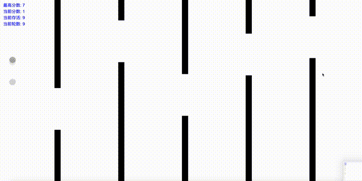

# FlappyBird AI

Program that learns to play Flappy Bird by machine learning. [Demo](https://atipezda.github.io/FlappyBird_Machine_learning/index.html)

**Train**

**Result**

## Tech stack

  - TensorFlow.js
  - p5.js
  - Typescript

## Acknowledgement

FlappyBird_Machine_learning: https://github.com/atipezda/FlappyBird_Machine_learning
